# Steering Vector Analysis for Language Models

## Overview

This project implements and analyzes "steering vectors" in transformer-based language models to mitigate harmful content. By calculating the difference between representations of harmful and safe content, we can generate steering vectors that effectively transform harmful content towards safer outputs when applied to the model's internal representations.

Similar to activation additions presented in the paper "[Activation Addition: Steering Language Models Without Optimization](https://arxiv.org/abs/2308.10248)" (Turner et al.), this technique allows direct manipulation of a model's internal representations to achieve more controlled outputs without requiring retraining or fine-tuning.

```mermaid
graph TD
    subgraph VectorComputation["Steering Vector Computation"]
        A[Mean Hate Representation<br>for Layer L] --> C
        B[Mean Safe Representation<br>for Layer L] --> C
        C[Vector Difference:<br>Safe Mean - Hate Mean] --> D[Steering Vector]
        D --> E[Optional: Normalize Vector]
    end
    
    subgraph CoefficientSelection["Coefficient Selection"]
        F[Small Coefficients<br>0.0 - 0.5]
        G[Medium Coefficients<br>1.0 - 2.0]
        H[Large Coefficients<br>3.0 - 5.0]
    end
    
    subgraph Application["Vector Application"]
        I[Original Hate Representation] --> K
        E --> J[Scaled Steering Vector:<br>coefficient × steering_vector]
        J --> K[Addition:<br>hate_rep + scaled_vector]
        K --> L[Steered Representation]
    end
    
    subgraph Effects["Effects by Coefficient Size"]
        F --> M[Subtle Changes<br>Preserves Original Meaning]
        G --> N[Optimal Transformation<br>Good Balance]
        H --> O[Strong Transformation<br>May Distort Content]
    end
    
    subgraph LayerSelection["Layer Selection"]
        P[Early Layers: 1-6<br>Basic Features]
        Q[Middle Layers: 7-18<br>Semantic Features]
        R[Late Layers: 19-24<br>Task-Specific Features]
    end
    
    style VectorComputation fill:#e6f3ff,stroke:#333,stroke-width:2px
    style CoefficientSelection fill:#fff0e6,stroke:#333,stroke-width:2px
    style Application fill:#e6fff0,stroke:#333,stroke-width:2px
    style Effects fill:#f3e6ff,stroke:#333,stroke-width:2px
    style LayerSelection fill:#fffee6,stroke:#333,stroke-width:2px
```



## Table of Contents

- [Overview](#overview)
- [Concept of Steering Vectors](#concept-of-steering-vectors)
- [Project Workflow](#project-workflow)
  - [Data Preparation](#data-preparation)
  - [Representation Extraction](#representation-extraction)
  - [Steering Vector Computation](#steering-vector-computation)
  - [Contrast Consistent Search (CCS)](#contrast-consistent-search-ccs)
  - [Evaluation](#evaluation)
- [Metrics Explained](#metrics-explained)
  - [Performance Metrics](#performance-metrics)
  - [Steering Quality Metrics](#steering-quality-metrics)
  - [Representation Metrics](#representation-metrics)
  - [Agreement Metrics](#agreement-metrics)
- [Implementation Details](#implementation-details)
- [Visualizations](#visualizations)
- [Results](#results)
- [Usage Instructions](#usage-instructions)
- [Requirements](#requirements)

## Concept of Steering Vectors

Steering vectors are computed as the difference between mean representations of safe and harmful content:

```
steering_vector = mean(safe_representations) - mean(harmful_representations)
```

When added to a harmful content representation, these vectors "steer" the representation toward safer content:

```
steered_representation = harmful_representation + coefficient * steering_vector
```

Where `coefficient` is a scaling factor that controls the strength of the steering effect.

<div align="center">
  
  <p><i>Figure: Interactive visualization showing how different coefficient values affect steering</i></p>
</div>

## Project Workflow

Our full workflow consists of several key stages, illustrated in the diagram below:


### Data Preparation

```mermaid
graph TD
    subgraph DataSource["Data Sources"]
        A1[Hate Speech Examples<br>with Label=1]
        A2[Safe Speech Examples<br>with Label=0]
    end
    
    subgraph DataImport["Data Import"]
        A1 --> B1[Load Hate Speech CSV]
        A2 --> B2[Load Safe Speech CSV]
        B1 --> C[Combine Into Single Dataset]
        B2 --> C
    end
    
    subgraph DataSplitting["Data Splitting"]
        C --> D[Split Into Train/Test Sets<br>70% / 30%]
        D --> E1[Training Set]
        D --> E2[Test Set]
    end
    
    subgraph DataBalancing["Data Balancing"]
        E1 --> F1[Ensure Equal<br>Hate/Safe Samples]
        E2 --> F2[Ensure Equal<br>Hate/Safe Samples]
    end
    
    subgraph Preprocessing["Text Preprocessing"]
        F1 --> G1[Train Data<br>Tokenization]
        F2 --> G2[Test Data<br>Tokenization]
    end
    
    subgraph RepresentationGeneration["Representation Generation"]
        G1 --> H1[Model Forward Pass<br>Train Data]
        G2 --> H2[Model Forward Pass<br>Test Data]
        H1 --> I1[Layer-wise<br>Representations<br>Train Data]
        H2 --> I2[Layer-wise<br>Representations<br>Test Data]
    end
    
    subgraph OutputFormat["Final Data Format"]
        I1 --> J1[Train Hate Reps<br>Shape: [n_hate, n_layers, hidden_dim]]
        I1 --> J2[Train Safe Reps<br>Shape: [n_safe, n_layers, hidden_dim]]
        I2 --> J3[Test Hate Reps<br>Shape: [n_hate, n_layers, hidden_dim]]
        I2 --> J4[Test Safe Reps<br>Shape: [n_safe, n_layers, hidden_dim]]
    end
    
    style DataSource fill:#f9f9f9,stroke:#333,stroke-width:2px
    style DataImport fill:#fff0e6,stroke:#333,stroke-width:2px
    style DataSplitting fill:#e6f3ff,stroke:#333,stroke-width:2px
    style DataBalancing fill:#e6fff0,stroke:#333,stroke-width:2px
    style Preprocessing fill:#f3e6ff,stroke:#333,stroke-width:2px
    style RepresentationGeneration fill:#fffee6,stroke:#333,stroke-width:2px
    style OutputFormat fill:#e6ffff,stroke:#333,stroke-width:2px
```

The dataset consists of pairs of statements labeled as either harmful (hate speech) or safe content:

```
statement,is_harmful_opposition
"Users who speak negatively about race should be permanently banned.",1
"Users who speak negatively about race should be educated about their harmful views.",0
```

### Representation Extraction

We extract representations from each layer of the language model for all input texts, resulting in tensors of shape `[num_samples, num_layers, hidden_dim]` containing the model's internal representations.

The extraction process involves:

1. Tokenizing the input text using the model's tokenizer
2. Running a forward pass through the pretrained language model
3. Extracting hidden states from all model layers
4. Storing the representations for further processing

### Steering Vector Computation

For each layer, we compute a steering vector as the difference between the mean representations of safe and harmful content. This generates a vector that points from harmful content toward safe content in the model's representation space.

The computation process involves:

1. Computing the mean of all hate content representations for a given layer
2. Computing the mean of all safe content representations for the same layer
3. Subtracting the hate mean from the safe mean to obtain the steering vector
4. Optionally normalizing the steering vector to control its magnitude

### Contrast Consistent Search (CCS)

```mermaid
graph TD
    subgraph CCSInputs["CCS Probe Inputs"]
        A[Original/Steered Hate Representation] -->|"x0"| D
        B[Safe Representation] -->|"x1"| D
    end
    
    subgraph CCSTraining["CCS Training Process"]
        D[CCS Probe Neural Network] --> E[Compute Loss Function]
        E -->|"Loss = Informative Loss + Consistent Loss"| F[Update Weights with Optimizer]
        F --> G[Repeat for Multiple Initializations]
        G --> H[Select Best Probe]
    end
    
    subgraph CCSPrediction["Prediction Process"]
        H --> I[Compute p0 for Hate Input]
        H --> J[Compute p1 for Safe Input]
        I --> K[Average Prediction = (p0 + (1-p1))/2]
        J --> K
        K --> L[Final Classification: pred > 0.5]
    end
    
    subgraph CCSSummary["Key Features"]
        M[Ensures Consistency Between Statements]
        N[Multiple Initializations for Robustness]
        O[Accounts for Both Inputs in Prediction]
        P[Can Be Applied to Any Layer or Coefficient]
    end
    
    style CCSInputs fill:#e6f3ff,stroke:#333,stroke-width:2px
    style CCSTraining fill:#fff0e6,stroke:#333,stroke-width:2px
    style CCSPrediction fill:#e6fff0,stroke:#333,stroke-width:2px
    style CCSSummary fill:#f0f0f0,stroke:#333,stroke-width:2px
```

The Contrast Consistent Search (CCS) probe is a classifier trained to distinguish between content types while maintaining consistency between statements and their negations. For each layer and steering coefficient, we train a separate CCS probe to evaluate the effectiveness of the steering.

Key features of CCS:

- Ensures consistency between statements and their negations
- Uses multiple initializations for robustness
- Considers both inputs in the final prediction
- Can be applied to any layer or coefficient combination

### Evaluation


Multiple metrics are used to evaluate the effectiveness of steering, from basic classification accuracy to sophisticated steering quality and semantic consistency metrics.


## Metrics Explained

The project uses a comprehensive set of metrics to evaluate different aspects of the steering process:

### Performance Metrics

These metrics evaluate how well the representations can be classified after steering:

1. **Accuracy**: Proportion of correctly classified examples after steering (higher is better)
   - Formula: `accuracy = (true_positives + true_negatives) / total_samples`
   - Range: 0 to 1, where 1 means perfect classification
   - Interpretation: Higher values indicate better separation between steered and safe content

2. **Silhouette Score**: Measures how well-separated the hate and safe clusters are in the representation space
   - Range: -1 to 1, where higher values indicate better separation
   - Interpretation: Values above 0.5 suggest strong cluster separation

3. **Precision**: Proportion of positive identifications that were actually correct
   - Formula: `precision = true_positives / (true_positives + false_positives)`
   - Range: 0 to 1
   - Interpretation: Higher values indicate fewer false positives

4. **Recall**: Proportion of actual positives that were correctly identified
   - Formula: `recall = true_positives / (true_positives + false_negatives)`
   - Range: 0 to 1
   - Interpretation: Higher values indicate fewer false negatives

5. **F1 Score**: Harmonic mean of precision and recall
   - Formula: `F1 = 2 * (precision * recall) / (precision + recall)`
   - Range: 0 to 1
   - Interpretation: Balances precision and recall; higher values indicate better overall performance

### Steering Quality Metrics

These metrics assess the quality and effectiveness of the steering vectors:

1. **Cosine Similarity Change**: Measures how the similarity between hate and safe representations changes after steering
   - Formula: `sim_change = cosine_sim(steered_hate, safe) - cosine_sim(original_hate, safe)`
   - Range: -2 to 2, but typically -1 to 1
   - Interpretation: Positive values indicate the steering moved hate representations closer to safe ones

2. **Normalized Path Length**: Measures how efficiently the steering vector moves representations along the ideal path
   - Formula: `path_length = |steered_hate - original_hate| / |safe - original_hate|`
   - Range: 0 to infinity, ideally close to 1.0
   - Interpretation: Values close to 1.0 indicate the steering takes a direct path toward safe representations

3. **Semantic Consistency**: Measures how well the semantic neighborhood is preserved after steering
   - Range: 0 to 1
   - Interpretation: Higher values indicate better preservation of original content meaning during steering

4. **Coefficient Weight Distribution**: Measures how well the steering vector aligns with the ideal direction
   - Formula: `alignment = cosine_similarity(steering_vector, ideal_direction)`
   - Range: -1 to 1
   - Interpretation: Values close to 1.0 indicate perfect alignment with the ideal steering direction

### Representation Metrics

These metrics analyze the properties of the model's internal representations:

1. **Class Separability**: Measures how well-separated the hate and safe representations are initially
   - Formula: Fisher's discriminant ratio = `between_class_variance / within_class_variance`
   - Range: 0 to infinity
   - Interpretation: Higher values indicate better natural separation between content types

2. **Representation Stability**: Measures the stability of representations against small perturbations
   - Range: 0 to 1
   - Interpretation: Values close to 1.0 indicate robust representations that resist small changes

3. **Decision Confidence**: Measures the confidence of the CCS probe's predictions
   - Range: 0.5 to 1.0
   - Interpretation: Higher values indicate more confident classifications

### Agreement Metrics

These metrics assess the logical consistency of the model's predictions:

1. **Agreement Score**: Measures consistency of predictions between statement pairs
   - Range: -1 to 1
   - Interpretation: Higher values indicate more consistent predictions across related statements

2. **Contradiction Index**: Measures logical inconsistencies in the steering transformations
   - Range: 0 to 1
   - Interpretation: Lower values indicate fewer contradictions

3. **Ideal Representation Distance**: Measures how close the steered representations are to the ideal safe representation
   - Range: 0 to 1
   - Interpretation: Lower values indicate better transformation toward safe content

## Implementation Details

The implementation follows these key steps:

1. **Data Loading and Preprocessing**:
   - Load hate speech and safe speech datasets
   - Split into train and test sets (70%/30%)
   - Balance classes to ensure equal representation

2. **Model Preparation**:
   - Load pretrained language model (e.g., DistilBERT, BERT, RoBERTa, GPT-2)
   - Configure tokenizer
   - Set up compute environment (CPU/GPU)

3. **Representation Extraction**:
   - Tokenize input text
   - Run forward pass through model
   - Extract hidden states from all layers
   - Store layer-wise representations

4. **Steering Vector Computation**:
   - Calculate mean hate and safe representations for each layer
   - Compute difference between mean vectors
   - Normalize steering vectors if needed

5. **Apply Steering Vectors**:
   - Apply steering vectors with different coefficients
   - Store steered representations for evaluation

6. **Evaluation with CCS Probe**:
   - Train CCS probe on original and steered representations
   - Compute comprehensive set of metrics
   - Generate visualizations and analysis

## Visualizations

<div align="center">
  
  <p><i>Figure: Heatmap showing effects of different coefficient values across layers</i></p>
</div>

The code generates several visualizations to help understand the steering process:

1. **Vector Visualization**: Shows the hate vector, safe vector, and steering vector in a 2D PCA projection for each layer
2. **PCA Layerwise Visualization**: Shows the separation of hate/safe content across different layers
3. **Coefficient Sweep Heatmaps**: Shows how different metrics vary with layer and steering coefficient
4. **Decision Boundary Visualization**: Shows how the CCS probe separates content in the steering direction
5. **Performance Metrics Charts**: Tracks metrics across layers for different steering coefficients

## Results

Example results for different steering coefficients across model layers:

| Layer | Steering Coefficient | Accuracy | Silhouette | Agreement | Semantic Consistency |
|-------|----------------------|----------|------------|-----------|----------------------|
| 1     | 0.0                  | 0.6241   | 0.0823     | 0.4132    | 0.7652               |
| 1     | 0.5                  | 0.7134   | 0.1245     | 0.5621    | 0.7543               |
| 1     | 1.0                  | 0.8376   | 0.1832     | 0.6843    | 0.7432               |
| 1     | 2.0                  | 0.9123   | 0.2341     | 0.7534    | 0.7321               |
| 1     | 5.0                  | 0.8745   | 0.1987     | 0.6891    | 0.6987               |
| 2     | 0.0                  | 0.6543   | 0.0912     | 0.4532    | 0.7765               |
| ...   | ...                  | ...      | ...        | ...       | ...                  |

### Key Findings

- Steering vectors are most effective at middle layers of the network (typically layers 6-18)
- Different coefficient strengths show different effectiveness, with optimal values typically between 1.0-2.0
- Performance varies significantly across model types (Encoder-only vs Decoder-only)
- The technique works without requiring full model fine-tuning
- Steering vectors can maintain semantic consistency while improving safety metrics

## Usage Instructions

To run the experiment:

```bash
python ordinary_steering.py
```

Configure the model family and variant in the script:

```python
model_family = "distilbert"  # Options: "distilbert", "bert", "roberta", "gpt2", "llama-3b", "llama-13b"
model_variant = "base"       # Options: "base", "fine-tuned"
```

### Configuration Options

- **Steering Coefficients**: Control the strength of steering (default: [0.0, 0.5, 1.0, 2.0, 5.0])
- **Layer Selection**: By default, all model layers are analyzed
- **Representation Strategy**: Choose between "first-token", "last-token", or "mean" strategies
- **CCS Parameters**: Adjust learning rate, batch size, and weight decay for the CCS probe

## Requirements

- PyTorch
- Transformers (Hugging Face)
- NumPy
- Pandas
- Matplotlib
- Scikit-learn
- Seaborn
- CUDA-capable GPU (recommended)
